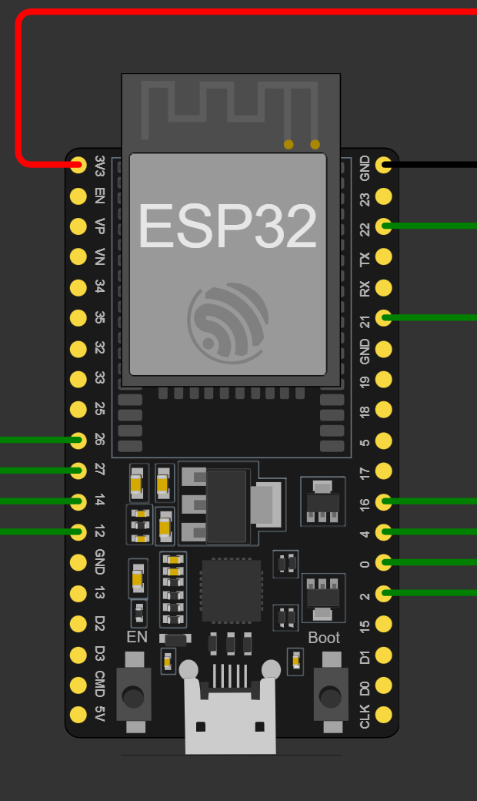

# Disaster-Net
A project on implementing LoRa-based communication, aimed at developing efficient, low-power networks.
## Keypad and Oled code 1
Established esp32 connection with a keypad and Oled, Fixed dialing activated for Keys 1 and 2. When a key is pressed the respective message is printed on the console and a "Sent" text is shown in the Oled confirming the data transfer. If a number without fixed dialing is pressed or no number is typed it will show "not sent" in Oled and print no message typed in console.
Paste my code in the website given below and run it.

https://wokwi.com/projects/380902363289847809

### Currently available fixed dialing:
* 1 - Help Me
* 2 - Not Feeling Well

The code is simulated in Wokwi and is working fine. The circuit diagram I used in Wokwi is given below:

* Esp32 pin diagram:

* Display pin diagram:
  

Check out this link for more : https://randomnerdtutorials.com/esp32-lora-rfm95-transceiver-arduino-ide/
